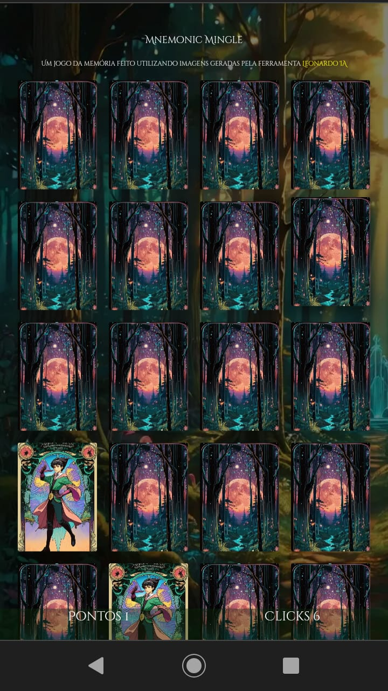

# Jogo da Memória

Um simples jogo da memória, as imagens foram feitas utilizando a ferramenta de geração de
imagens [Leonadro IA](https://app.leonardo.ai/).

A idéia era m projeto que fosse possíel terminar em um dia.

## Executando o projeto

```shell
npm install && npm run serve
```

Depois é só acessar `localhost:9000` no navegador.

